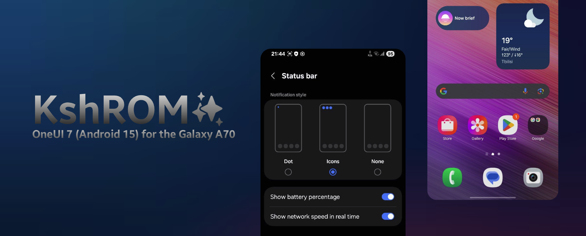

KshROM is a fork of UN1CA-A70 for the Galaxy A70

## DISCLAIMER
Your warranty is now **void**.  
I am **not responsible** for bricked devices, dead SD cards, or anything else that goes wrong.  

⚠️ **This is BETA! Do not use as your main! YOU HAVE BEEN WARNED.**

---

This is my first ever personal project. I’m still learning and some features may not work.  
**Testers are welcome!**

---

## INFORMATION OF THIS ROM
- Based on **A736BXXUAFYE6 (Galaxy A73 5G)**
- **OneUI 7 (Android 15)**

---

## FEATURES
- Galaxy AI (AI Photo Editor)  
- Performance Based Debloat  
- Selinux Enforcing  
- Battery Tweaks  
- Smart View Support  
- Fullscreen AOD (shows lockscreen wallpaper)  
- RIL Functional  
- Fingerprint Support  
- Bluetooth Library Patcher Included  
- KnoxPatch Implemented In System Frameworks  
- DeKnoxed  

---

## KNOWN BUGS
- Face Unlock not working *(unfixable since A70 never got One UI 5)*  
- Bluetooth not working *(might get fixed)*  
- Small Black Cube around camera *(investigating issue)*  
- NFC (PN547 and non-NFC models only)  
- Not tested on A705F/MN/GM (please try flashing and let me know!)  
- Disable **"Sending Diagnostic Data"** during setup  

---

## DOWNLOAD
📸 **Screenshots** - [Click Here](https://drive.google.com/drive/u/1/folders/1U3BWA1ijYLHvS-vLWN4Sr3Ivoxn492WM)  
📦 **ROM** - [Download](https://drive.google.com/drive/u/1/folders/1sa-m-UYomUOoGDGYV3eYE3AOHeOMWnxU)  

---

## SOURCES
- [UN1CA Project](https://github.com/salvogiangri/UN1CA)  
- [UN1CA-A70](https://github.com/tisenu100/UN1CA-A70)  
- [Kernel Source Code](https://github.com/LineageOS/android_kernel_samsung_sm6150)  

---

## INSTALLATION GUIDE
> ⚠️ **WARNING: THIS WILL WIPE YOUR ENTIRE PHONE!**  
> Proceed at your own risk.

1. Download and install the **Samsung USB Driver** (Windows users).  
2. Ensure you are on the latest **A70 firmware A705FNXXU5DXD4** (otherwise features may break).  
3. Unlock your bootloader fully *(not only from settings)*.  
4. Boot into **Download Mode**.  
5. Flash the custom recovery → [Download Recovery](https://github.com/rtd1250/a70q_OTA/releases/download/20250628/lineage-22.2-20250628-recovery-a70q.tar).  
6. Boot into recovery →  
   - Factory reset → **Format system partition**  
   - Return to menu → **Apply update → Apply from ADB**  
7. On PC:  
   - Linux → `sudo apt install adb && adb sideload rom.zip`  
   - Windows → Use **SDK Platform Tools** and do **adb sideload rom.zip**
8. Wait for installation to finish.  
9. Reboot and enjoy.

---

## CREDITS
- **@Kianish** — Kshrom, Performance Tweaks, Battery Optimization, Network tweaks, Banner, Idea 🟣  
- **@Tisenu100** — UN1CA-A70 Base, Patches, Mods, Full Selinux Support 🛠️  
- **@salvogiangri** — UN1CA Project, KnoxPatch  
- **@nookgit12** — Build assistance  
- **LineageOS Team** — For keeping SM6150 devices alive  
- **@ExtremeXT** — Bluetooth Library Patch Support for One UI 7 Devices, Mods like: Battery Health, Battery Cycles count, Outdoor Mode, owns ExtremeROM
- **@3arthur6** — Bluetooth Library Patch  

---

## COMMUNITY
💬 Have a question? Join our [Telegram Group](https://t.me/kshrom)

# Licensing:
KshROM abides to the GPLv3 license like the original UN1CA project

# Kernel Version
Kernel Version: 4.14.190
